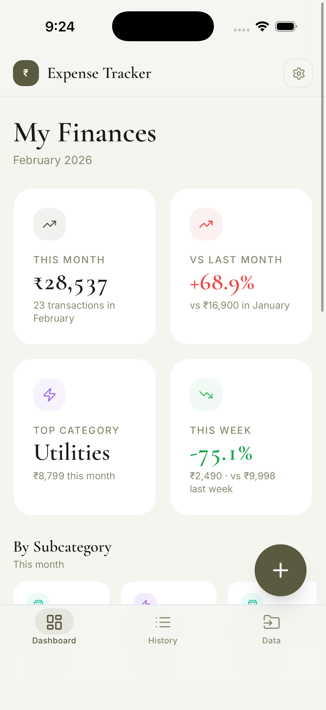
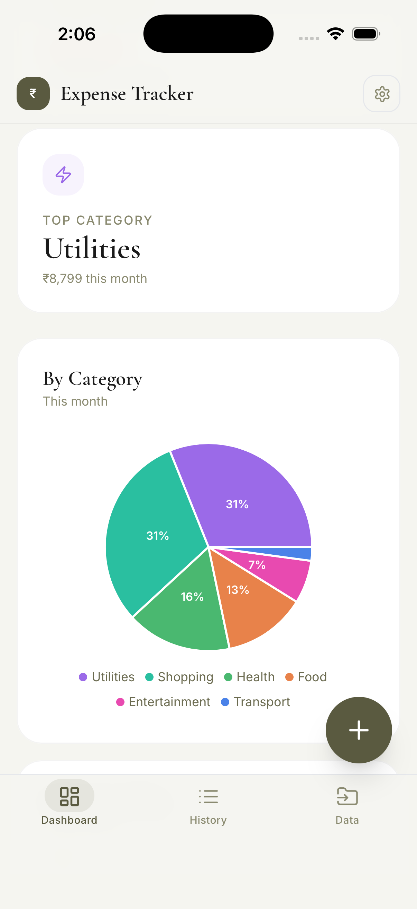
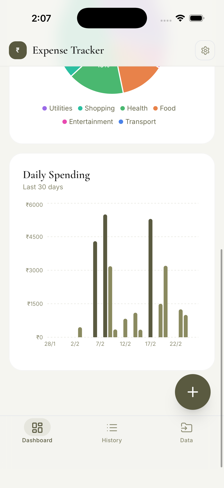
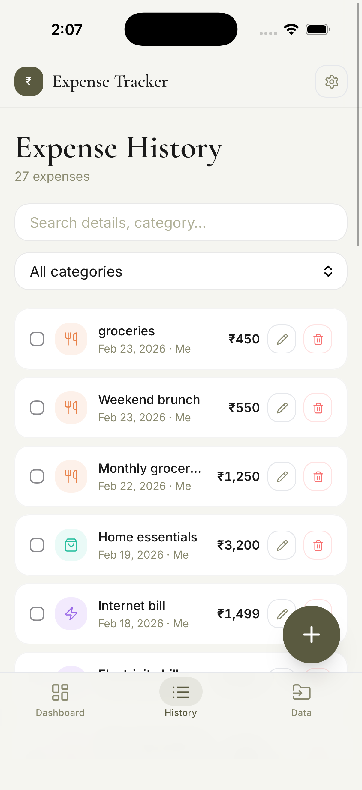
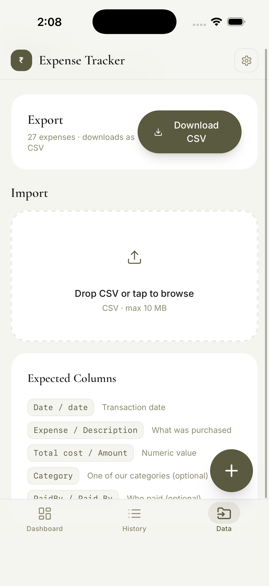
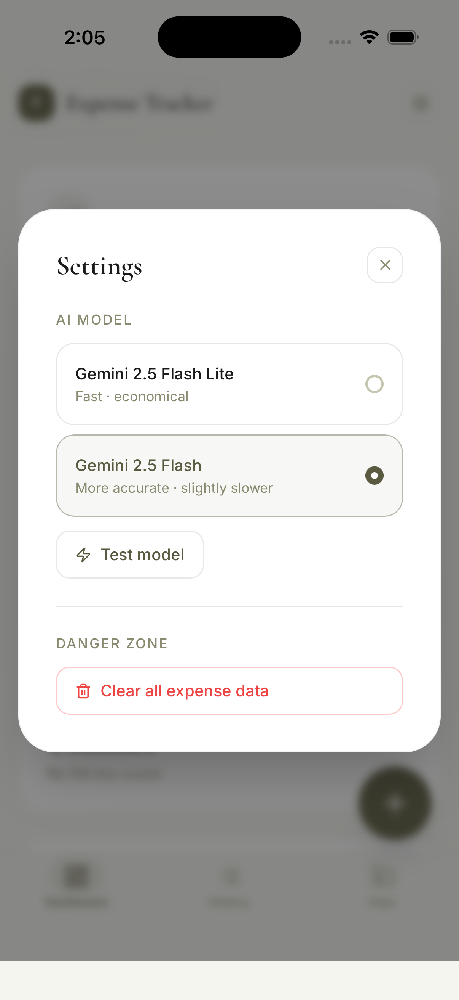
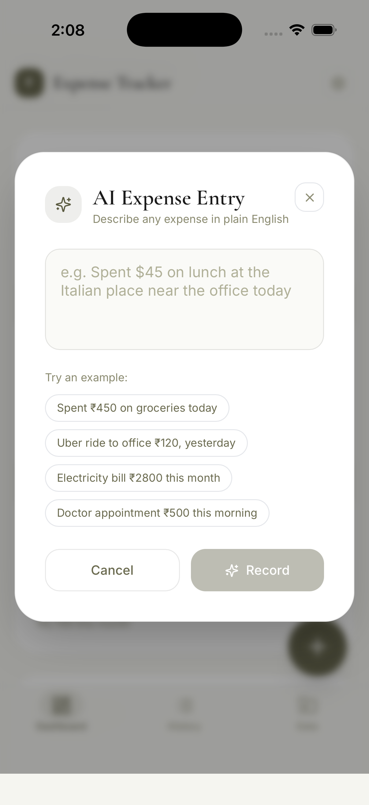
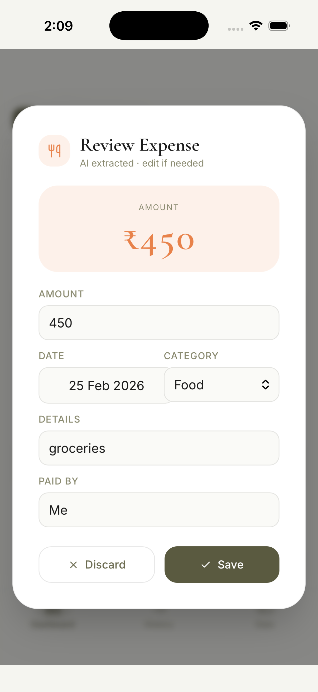
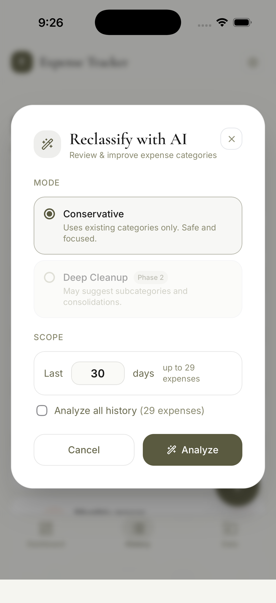

# ExpenseManager

A personal iOS expense tracking app with AI-powered entry, built with React + Capacitor. Log expenses by typing naturally — "spent ₹450 on groceries" — and Gemini extracts the details.

  

---

## Features

- **AI Entry** — describe an expense in plain text; Gemini extracts amount, category, date and details; original prompt is stored immutably alongside the record
- **Subcategory support** — pick a subcategory chip at entry time, or let AI reclassification fill them in automatically
- **Reclassify with AI** — batch-process any date range of expenses through Gemini to fix categories and add subcategories; review proposed changes before applying; 30-second undo window
- **Dashboard** — 4 KPI cards (this month, vs last month, top category, this week vs last week till date), subcategory spend tiles, category pie chart, 30-day daily bar chart (tap a bar to drill into that day)
- **History** — searchable and sortable list, inline edit, single and bulk delete; subcategory shown per row
- **CSV Import / Export** — drag-and-drop import with column auto-mapping; export now includes Subcategory and Original Prompt columns
- **Persistent storage** — data lives in native iOS `UserDefaults` via `@capacitor/preferences` (survives app updates, never auto-evicted)
- **Settings** — switch between Gemini 2.5 Flash Lite and Flash, test connectivity, clear all data

---

## Tech Stack

| Layer | Technology |
|---|---|
| UI | React 18 + Vite |
| Styling | Tailwind CSS 3 |
| Animation | Motion (Framer Motion) |
| Charts | Recharts |
| Native bridge | Capacitor 8 |
| Native storage | `@capacitor/preferences` (iOS UserDefaults) |
| AI | Google Gemini API |
| Icons | Lucide React |

---

## Prerequisites

Make sure these are installed before you start.

| Tool | Version | Install |
|---|---|---|
| Node.js | 18+ | [nodejs.org](https://nodejs.org) or `brew install node` |
| npm | 9+ | bundled with Node |
| Xcode | 15+ | Mac App Store |
| Xcode Command Line Tools | latest | `xcode-select --install` |
| CocoaPods | latest | `sudo gem install cocoapods` |

> You need a Mac with Xcode to build and run the iOS app.

---

## Setup

### 1. Clone the repo

```bash
git clone https://github.com/git-hub-me/expense-manager.git
cd expense-manager
```

### 2. Install all dependencies

```bash
npm run setup
```

This installs root, backend, and frontend dependencies in one step.

### 3. Add your Gemini API key

```bash
cp frontend/.env.example frontend/.env.local
```

Open `frontend/.env.local` and replace the placeholder:

```
VITE_GEMINI_API_KEY=your_actual_key_here
```

Get a free key at [aistudio.google.com](https://aistudio.google.com/app/apikey).

### 4. Install iOS CocoaPods

```bash
cd frontend/ios/App
pod install
cd ../../..
```

---

## Running Locally (Browser)

```bash
npm run dev
```

Opens the Vite dev server at `http://localhost:5173`. The full app runs in the browser — AI entry, charts, CSV import all work. Native storage falls back to a browser shim automatically.

---

## Running on iPhone / Simulator

### Build and sync

```bash
cd frontend
npm run build
npx cap sync ios
```

### Open in Xcode

```bash
npx cap open ios
```

Select your target device or simulator in Xcode and press **Run** (⌘R).

> On a physical device you need a free Apple Developer account and to trust the certificate in Settings → General → VPN & Device Management.

### One-liner for iterating

```bash
cd frontend && npm run build && npx cap sync ios
```

Run this after any code change, then press Run in Xcode again.

---

## Project Structure

```
expense-manager/
├── frontend/                  # React + Capacitor app
│   ├── src/
│   │   ├── components/        # UI components
│   │   │   ├── AIEntry.jsx           # Natural language expense entry
│   │   │   ├── Dashboard.jsx         # Charts + stats overview
│   │   │   ├── History.jsx           # Expense list + edit/delete
│   │   │   ├── CSVImport.jsx         # Import & export
│   │   │   ├── PendingExpense.jsx    # AI result review modal (+ subcategory picker)
│   │   │   ├── ReclassifyConfig.jsx  # Reclassify scope/mode config modal
│   │   │   ├── ReclassifyReview.jsx  # Diff-table review before applying changes
│   │   │   ├── Settings.jsx          # Model config + data clear
│   │   │   ├── Navigation.jsx        # Tab bar + header
│   │   │   ├── StatsGrid.jsx         # KPI cards (monthly, MoM, top category, WTD)
│   │   │   └── charts/
│   │   │       ├── CategoryPie.jsx
│   │   │       └── DailyBar.jsx
│   │   ├── lib/
│   │   │   ├── storage.js         # Capacitor Preferences CRUD + reclassify apply/undo
│   │   │   ├── reclassify.js      # Gemini batched reclassification engine
│   │   │   └── constants.js       # Categories, subcategories, formatters
│   │   ├── App.jsx                # Root component + state
│   │   └── index.css
│   ├── ios/                   # Native iOS project (Xcode)
│   ├── capacitor.config.json
│   └── .env.example           # Copy to .env.local and fill in key
├── backend/                   # Express.js server (optional)
│   └── server.js
└── package.json               # Root scripts (setup, dev)
```

---

## Environment Variables

| Variable | Required | Description |
|---|---|---|
| `VITE_GEMINI_API_KEY` | Yes | Google Gemini API key for AI entry |

The key is baked into the JS bundle at build time (Vite `VITE_` convention). Keep the repo private or use a key with usage limits set in Google AI Studio.

---

## CSV Import Format

The importer is flexible — column names are case-insensitive and several aliases are accepted.

| Column | Aliases | Notes |
|---|---|---|
| `Date` | `date` | YYYY-MM-DD or any JS-parseable date |
| `Expense` | `Description`, `details`, `Note` | Free text |
| `Total cost` | `Amount`, `Cost`, `Total` | Numeric |
| `Category` | `category` | Food, Transport, Utilities, Entertainment, Shopping, Health, Other |
| `Subcategory` | `subcategory` | Optional; e.g. Groceries, Fuel, Streaming |
| `PaidBy` | `Paid By`, `paid_by` | Defaults to "Me" |

CSV **export** includes two additional columns: `Subcategory` and `Original Prompt` (the raw text used to create AI-entered expenses; empty for manual entries).

---

## Scripts

| Command | What it does |
|---|---|
| `npm run setup` | Install all dependencies (root + backend + frontend) |
| `npm run dev` | Run frontend Vite dev server + backend concurrently |
| `npm run dev:frontend` | Frontend only |
| `npm run dev:backend` | Backend only |
| `cd frontend && npm run build` | Production build |
| `cd frontend && npx cap sync ios` | Sync web build to native iOS |
| `cd frontend && npx cap open ios` | Open Xcode |

---

## Screenshots

<p align="center">
  
  
  
</p>
<p align="center">
  
  
  
</p>
<p align="center">
  
  
</p>
<p align="center">
  
  
</p>
